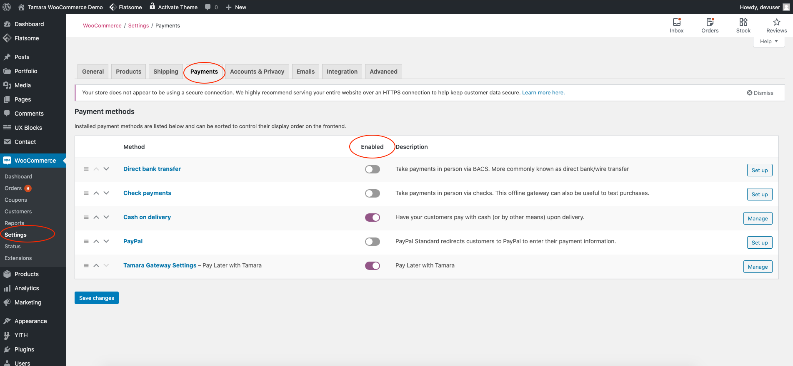
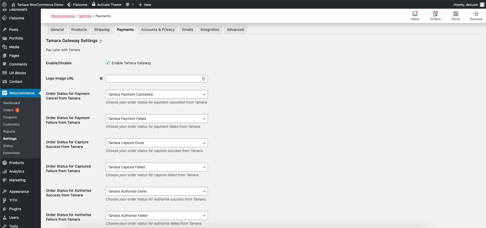
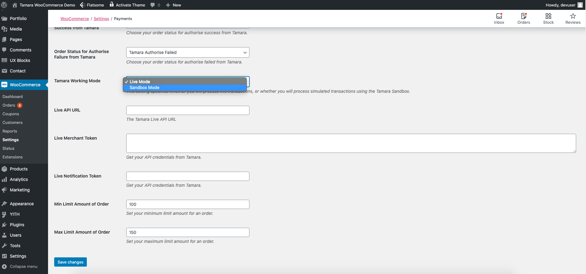
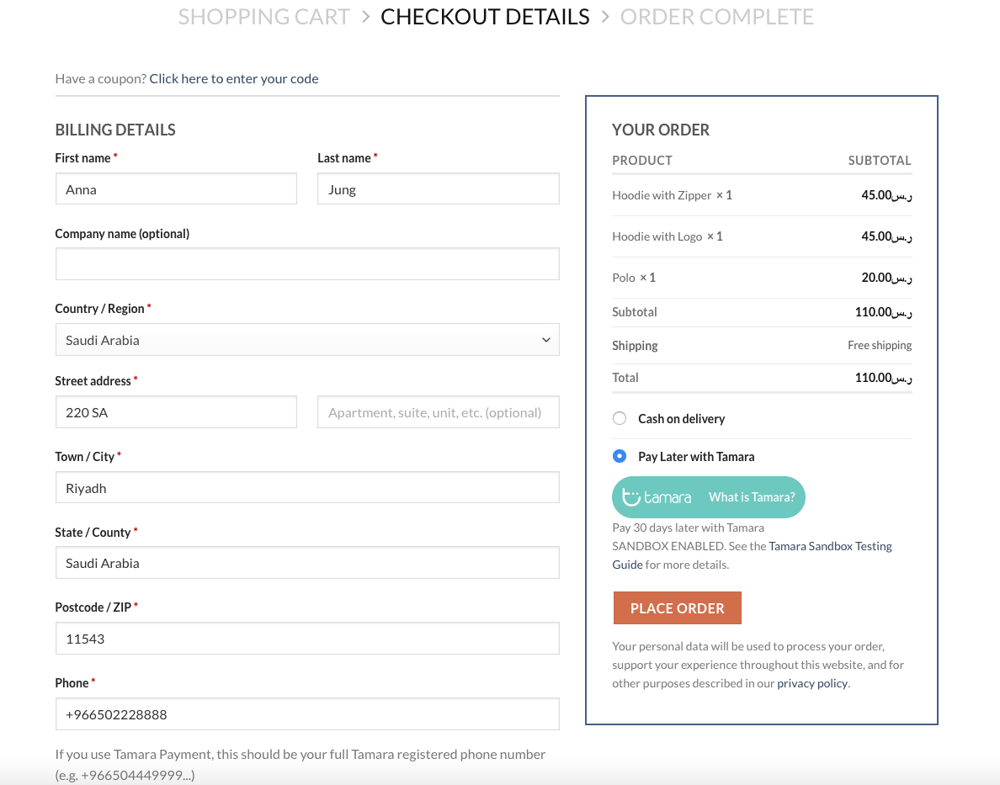
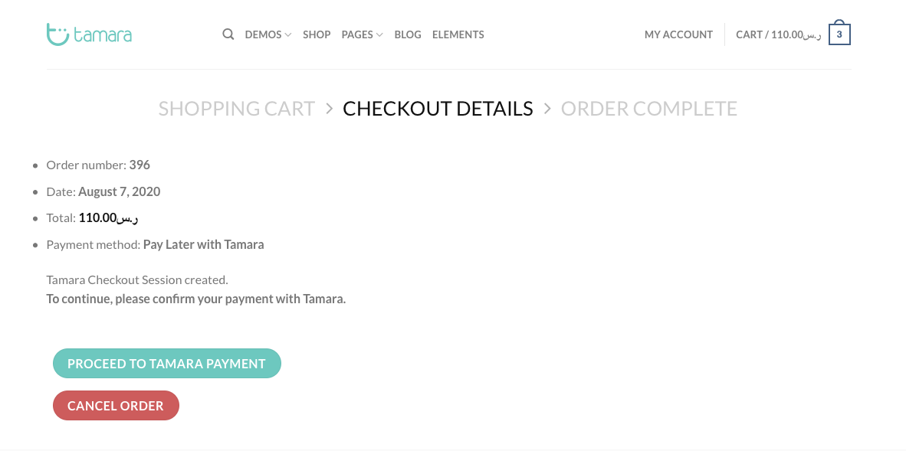
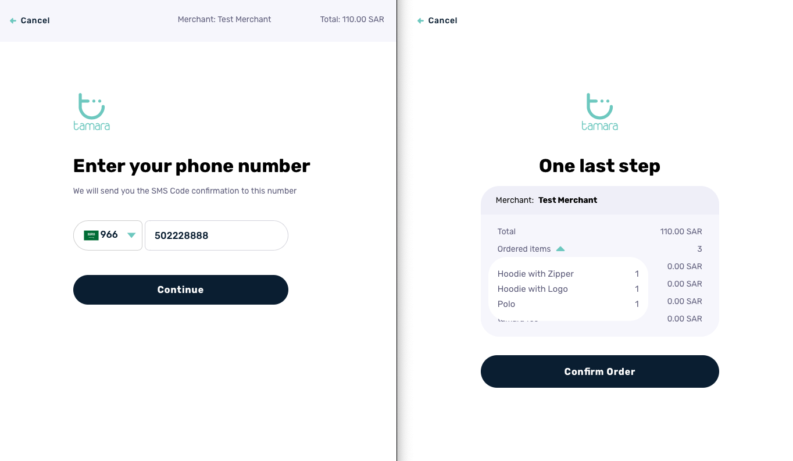
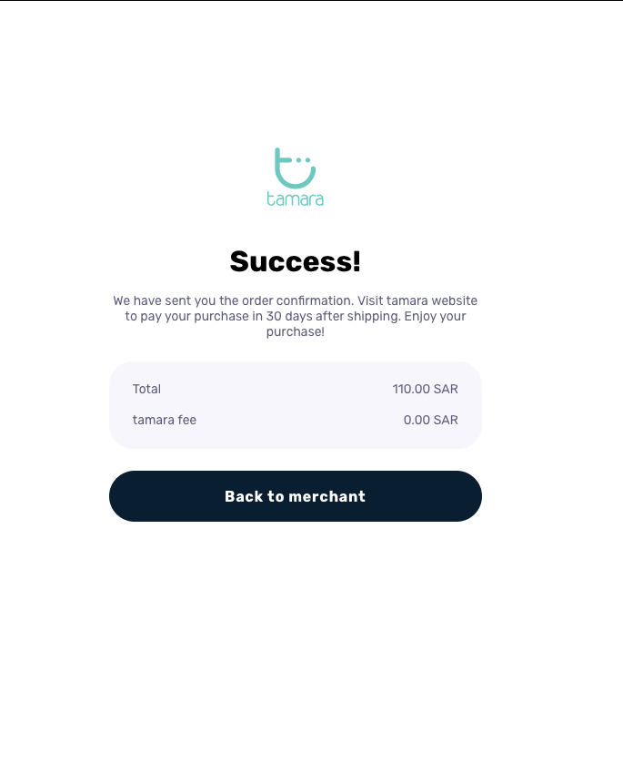
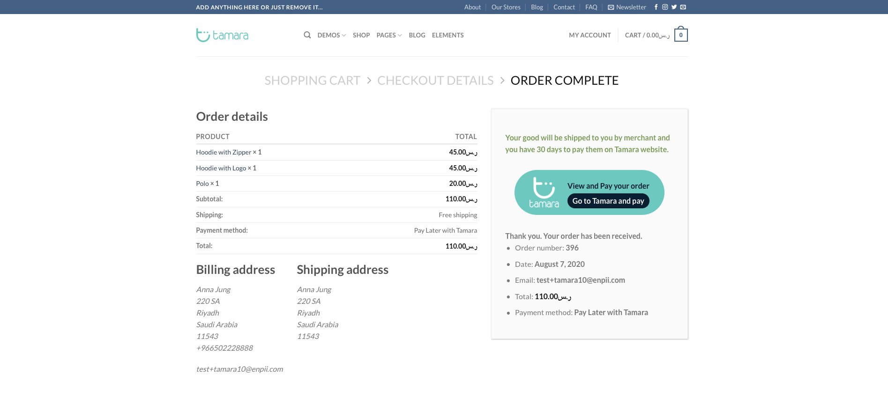
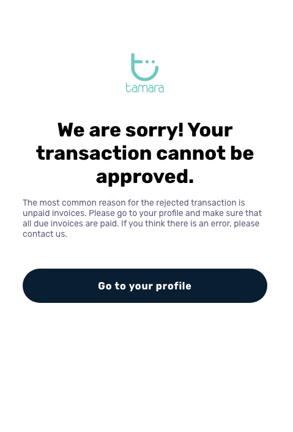
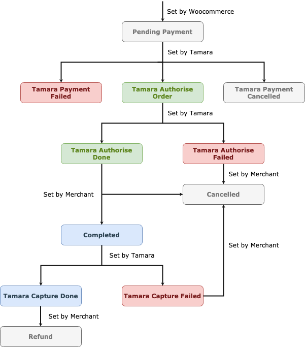

## Required version:
- Wordpress: >= 5.2
- Woocommerce: >=4.0

## Introduction
- Tamara is a Buy Now Pay Later solution in Saudi Arabia and the UAE.
- Benefits to merchants:
  - More sales: Higher average order value, conversion, repeat purchases and less card transaction declined.
  - Access to quality customers: tamara directs new customers to merchants through its network.
  - No collections: tamara collects from the customers, not merchants. 
  - No fraud and credit risk: tamara assumes 100% of payment risk on behalf of the merchant.
  - No COD: In case merchants offer it, we'll take this headache away from them and provide a better alternative.
  - Logistics: Freedom to select the top couriers (e.g. DHL) as there is no restriction on specific couriers who collect cash. 
- Benefits to customers:
  - Convenient and smooth checkout experience: No friction of having customers to pay upfront. 
  - In-store experience for e-commerce: Customers can try the product at home without having to pay upfront.
  - Payment flexibility and better money management: Pay later in 30 days or in installments.
  - Trust: customers can purchase the products they love with peace of mind. No credit/debit card details needed upfront, no chasing logistics companies for delivery. 

## Install and Enable/Disable the plugin
- The Tamara Checkout plugin is now available for Wordpress. After installing it, simply click on `Activate` the plugin.
- Please note that the plugin can only be activated when Woocommerce is active.
- After the plugin is activated, there is an option to Enable/Disable the plugin in Woocommerce => Settings => Payments => Tamara Gateway Settings.

## Configure Tamara’s setting
To configure the Tamara Gateway Settings, go to Woocommerce => Settings => Payments => Tamara Gateway Settings.

There are several options for you to customize:
- “Enable/Disable” - To enable/disable Tamara Payment gateway for Woocommerce.
- “Logo Image URL” - URL of image icon to appear on payment method selecting. The recommended size must be no larger than 230x60, image format.
- “Order Status for Payment Cancel from Tamara”  - Choose your order status for payment cancelled from Tamara.
- “Order Status for Payment Failure from Tamara”  - Choose your order status for payment failed from Tamara.
- “Order Status for Capture Success from Tamara”  - Choose your order status for capture success from Tamara.
- “Order Status for Captured Failure from Tamara”  - Choose your order status for capture failed from Tamara.
- “Order Status for Authorise Success from Tamara”  - Choose your order status for authorise success from Tamara.
- “Order Status for Authorise Failure from Tamara”  - Choose your order status for authorise failed from Tamara.
- “Tamara Working Mode”  - This setting specifies whether you will process live transactions, or whether you will process simulated transactions using the Tamara Sandbox.

Whether you wish to use the Live or Sandbox mode, please fill in the appropriate information (API URL, Merchant Token, Notification Token) provided by Tamara

## Use Tamara as Woocommerce payment method (Customer’s side)
- For customers, who want to use Tamara as their payment method, click on the “Pay Later with Tamara” on the checkout section.
- Remember to fill in the correct Billing details which should match with your information registered with Tamara (Name, Address, Phone number, Email…). If not, there might be a Payment Declined form Tamara, which will result in a Payment failed for your order.
- The “Tamara Working Mode” also should be set before placing the order.

- After choosing the payment method and place order, another confirmation screen will appear before proceeding to the Tamara page.
- This is considered as a payment method confirmation for your order before redirecting to Tamara page.
- If you wish to cancel the order or customize your order, simply click on the “Cancel Order” button. Otherwise, proceed to the Tamara Checkout page.

- On the Tamara Checkout page, you are required to fill in your account and pin code.
- And one last step, is to recheck your order detail information. If everything is correct, click on “Confirm Order” to make a payment.

- After a successful payment, there will be a notification of Success and you can go back to the Merchant page to check your order status.

- If there is any problem with your Tamara account or the order’s detail, an error message would be shown.

- For this case, please check again your order information and your Tamara account. If the problem is not resolved, you can contact Tamara for more detail.

## Order status’s flow with Tamara Gateway (For Admin/Merchant user)
There are custom order statuses from Tamara Gateway, which can be set in “Tamara Gateway Settings”. You should choose a label for the appropriate status, which the system can understand and return the right order status after every process.
Tamara Gateway customs WooCommerce Order Statuses Completely Integrated into your Workflow.

### Note:
- The order should be authorized by Tamara and can be cancelled before being captured.
- After an order is completed, it will be captured. The due date will start counting for the customer at this moment.
- Once being captured, it can not be “Cancelled”, in this case, use the “Refund” function instead.